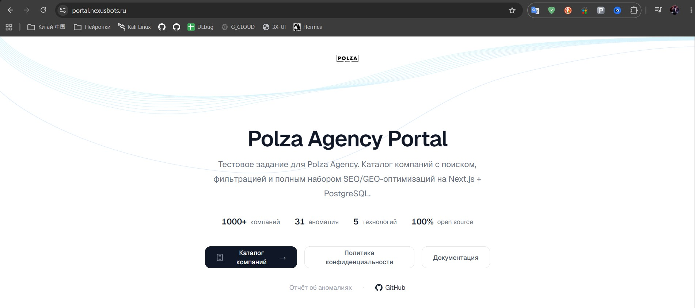
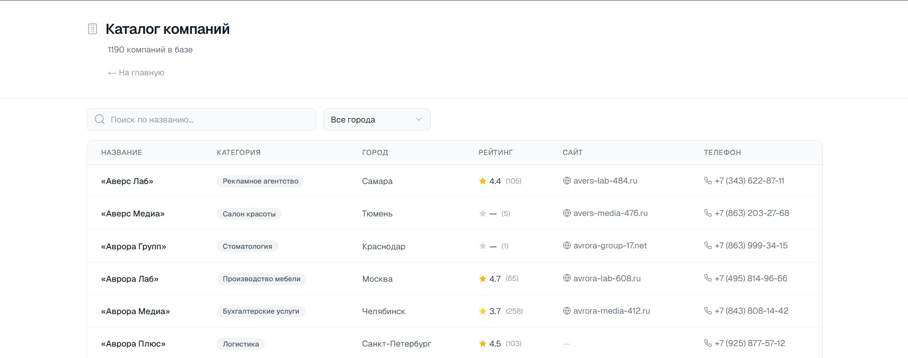
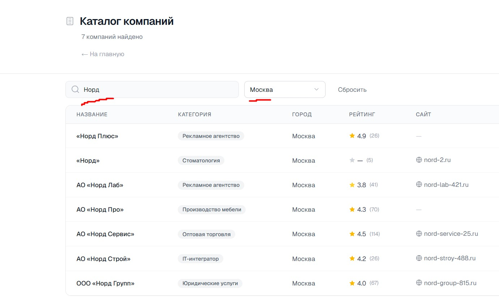
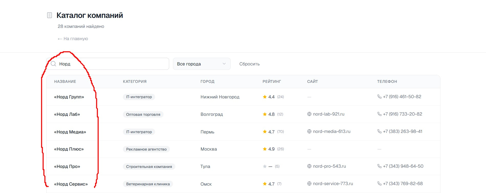

<div align="center">

# Companies Directory

**ETL-пайплайн + веб-интерфейс загрузки и анализа данных компаний**


[Демо](#-быстрый-старт) · [SQL-запросы](#-sql-запросы) · [Аномалии](./ANOMALIES.md) · [Структура](#-структура)

</div>

---

## ✨ О проекте

**Companies Directory** — тестовое задание на позицию «Технический специалист / вайбкодер» в Polza Agency.

Проект представляет собой ETL-пайплайн, который загружает 1190 записей о компаниях из гетерогенных источников (JSON + CSV) в PostgreSQL, и веб-интерфейс на Next.js 16 с поиском, фильтрацией и тремя аналитическими SQL-запросами.

> 💡 **Ключевая особенность:** автоматическое детектирование и исправление аномалий данных — сдвиг колонок, mojibake, текст в числовых полях, невалидные телефоны/сайты — с полным отчётом в [`ANOMALIES.md`](./ANOMALIES.md).

---

## 🎯 Функционал

|     |                                                                                     |
| --- | ----------------------------------------------------------------------------------- |
| 🗄️  | **ETL-пайплайн** — загрузка 1190 записей из 20 JSON-файлов + CSV в PostgreSQL      |
| 🧹  | **Авто-валидация** — mojibake, сдвиг колонок, пустые строки, текст в числах         |
| 🔍  | **Поиск по названию** — фильтрация компаний в реальном времени                      |
| 🏙️  | **Фильтр по городу** — 20 городов, выпадающий список                                |
| 📊  | **Топ-5 категорий** — IT-интегратор, Оптовая торговля, Рекламное агентство и др.    |
| ⭐  | **Средний рейтинг по городам** — среди компаний с 10+ отзывами                      |
| 🌐  | **Доля компаний с сайтом** — по каждой из 22 категорий                              |
| 📱  | **Адаптивность** — корректное отображение на всех устройствах                       |
| 🎭  | **Notion-минимализм** — чистый белый фон, Geist шрифт, luxury SVG-иконки             |
| 📋  | **Отчёт об аномалиях** — 31 инцидент: от пустых строк до shared-site.ru             |

---

## 🏗 Структура

```
.
├── docker-compose.yml           # PostgreSQL 16 в Docker
├── ANOMALIES.md                 # Отчёт по аномалиям данных (31 инцидент)
├── README.md
│
├── db/
│   ├── schema.sql               # DDL схемы (справочно)
│   ├── init.sql                 # Инициализация БД (Docker entrypoint)
│   └── queries.sql              # 3 аналитических запроса
│
├── scripts/
│   ├── package.json
│   ├── tsconfig.json
│   ├── load_data.ts             # ETL: загрузка и валидация данных
│   └── ...
│
├── next-app/
│   ├── .env.example
│   ├── src/
│   │   ├── app/
│   │   │   ├── page.tsx
│   │   │   ├── layout.tsx
│   │   │   └── companies/
│   │   │       ├── page.tsx              # Server Component
│   │   │       └── CompaniesClient.tsx   # Client Component
│   │   ├── components/
│   │   │   └── icons.tsx                # Luxury SVG иконки
│   │   └── lib/
│   │       └── db.ts                    # PostgreSQL connection
│   ├── Dockerfile
│   ├── package.json
│   └── ...
│
└── TZ/
    ├── MATERIALS.md
    ├── ANOMALIES.md (оригинал)
    └── data_pack/
        ├── page_001.json … page_020.json  # ~1000 компаний
        └── review.csv                     # ~200 записей с аномалиями
```

---

## 🗄️ Источники данных

| Источник      | Формат | Записей | Особенности                                         |
| ------------- | ------ | ------- | --------------------------------------------------- |
| **page_*.json** | JSON   | 994     | 20 файлов, стандартизированные данные                |
| **review.csv**  | CSV    | 205     | Аномалии: mojibake, сдвиг колонок, текст в числах   |

После дедупликации по **ID** (последняя запись побеждает) — **1190 уникальных записей**.

---

## ⚡ Быстрый старт

### 1. PostgreSQL

```bash
cp .env.example .env
# укажи свой пароль в .env (POSTGRES_PASSWORD)
docker compose up -d
```

БД доступна на `localhost:5432`, БД — `companies`, пользователь и пароль — из `.env`.

### 2. ETL-загрузка

```bash
cd scripts
npm install
npm run load
```

Скрипт последовательно:
1. Читает 20 JSON-файлов → Map по ID
2. Читает review.csv → парсинг с `csv-parse` (relax_column_count, BOM)
3. Валидирует каждое поле: рейтинг, отзывы, сайт, телефон
4. Детектирует mojibake, сдвиг колонок, варианты городов
5. Дедуплицирует (CSV перезаписывает JSON)
6. Загружает 1190 строк в PostgreSQL (batch insert по 100)

### 3. Веб-интерфейс

```bash
cd next-app
cp .env.example .env
npm install
npm run dev
# → http://localhost:3000/companies
```

---

## 📊 SQL-запросы

Три аналитических запроса из [`db/queries.sql`](./db/queries.sql):

### 1️⃣ Топ-5 категорий по числу компаний

```sql
SELECT category, COUNT(*) AS company_count
FROM companies WHERE category IS NOT NULL
GROUP BY category ORDER BY company_count DESC LIMIT 5;
```

| Категория             | Компаний |
| --------------------- | -------- |
| IT-интегратор         | 112      |
| Оптовая торговля      | 93       |
| Рекламное агентство   | 90       |
| Строительная компания | 88       |
| Юридические услуги    | 72       |

### 2️⃣ Средний рейтинг по городам (10+ отзывов)

```sql
SELECT city, ROUND(AVG(rating)::numeric, 2) AS avg_rating, COUNT(*) AS company_count
FROM companies
WHERE rating IS NOT NULL AND reviews_count >= 10
GROUP BY city ORDER BY avg_rating DESC;
```

| Город          | Средний рейтинг | Компаний |
| -------------- | --------------- | -------- |
| Омск           | 4.43            | 25       |
| Пермь          | 4.43            | 34       |
| Тюмень         | 4.36            | 27       |
| Сочи           | 4.36            | 16       |
| …              | …               | …        |
| **Всего:**     | **20 городов**  |          |

### 3️⃣ Доля компаний с сайтом по категориям

```sql
SELECT category,
       COUNT(*) AS total,
       COUNT(*) FILTER (WHERE site IS NOT NULL) AS with_site,
       ROUND(100.0 * COUNT(*) FILTER (WHERE site IS NOT NULL) / COUNT(*), 1) AS pct_with_site
FROM companies WHERE category IS NOT NULL
GROUP BY category ORDER BY pct_with_site DESC;
```

| Категория             | Всего | С сайтом | %     |
| --------------------- | ----- | -------- | ----- |
| Ресторан              | 48    | 41       | 85.4% |
| Клининг               | 20    | 17       | 85.0% |
| Производство мебели   | 52    | 43       | 82.7% |
| …                     | …     | …        | …     |
| Строительная компания | 88    | 59       | 67.0% |
| Типография            | 32    | 20       | 62.5% |

---

## 🧹 Аномалии данных

Подробный отчёт — в [ANOMALIES.md](./ANOMALIES.md). Всего **31 инцидент**:

| Категория                    | Кол-во | Пример                                            |
| ---------------------------- | ------ | ------------------------------------------------- |
| Пустые строки                | 2      | Полностью пустые строки в конце CSV                |
| Дубликаты ID                 | 9      | JSON↔CSV (6) + внутренние CSV (3)                  |
| Невалидный рейтинг           | 4      | `N/A`, `-3`, `7.2`, `4,5` (запятая)               |
| Невалидное число отзывов     | 3      | `-10`, `45.5`, `много`                             |
| Сдвиг колонок                | 1      | category = «Пермь» (город вместо категории)         |
| Variants городов             | 5      | Москва / москва / Moscow / Санкат-Петербург        |
| Mojibake (битая кодировка)   | 3 поля | `РћРћРћ «Заря Тех»` → ООО «Заря Тех»     |
| Текст вместо URL в site      | 1      | «нет сайта» → NULL                                 |
| Опечатка в протоколе URL     | 1      | `htp://…` → NULL                                   |
| Подозрительный site          | 2      | `shared-site.ru` у двух разных компаний             |
| Невалидный телефон           | 2      | `8 (925) abc-12-34`, `+7` (только код)             |
| ID вне диапазона             | 1      | `c_900010` вместо `c_001xxx`                       |

---

## 🛠 Технологии

```
┌─────────────────────────────────────────────────────────────┐
│  Next.js 16        →  Server Components, App Router         │
│  TypeScript 5      →  типобезопасность                      │
│  PostgreSQL 16     →  реляционная БД                        │
│  Docker            →  контейнеризация БД                     │
│  Tailwind CSS 4    →  утилитарные стили                      │
│  csv-parse         →  парсинг CSV (BOM, relax_column_count) │
│  iconv-lite        →  исправление mojibake (UTF-8 ↔ CP1251) │
│  pg (node-postgres)→  клиент PostgreSQL                     │
│  pg-format         →  экранирование bulk INSERT             │
└─────────────────────────────────────────────────────────────┘
```

---

## 🔒 Безопасность

- Все секреты — только в `.env` (в `.gitignore`)
- `.env.example` коммитится (шаблон без секретов)
- SQL-инъекции: все запросы — параметризованные (`$1`, `$2`, …)
- Проверка текстовых полей на prompt/SQL injection (DROP, ignore, `<script>`) — ничего не найдено

---

## 📋 Проверка результата

### Пошаговая проверка

```bash
# 1. Запустить PostgreSQL
docker compose up -d

# 2. Загрузить данные
cd scripts && npm run load

# 3. Запустить Next.js
cd ../next-app && npm run dev

# 4. Открыть браузер
#    http://localhost:3000/companies

# 5. Выполнить SQL-запросы
docker exec companies-db psql -U user -d companies \
  -f /docker-entrypoint-initdb.d/queries.sql
```

### Скриншоты функциональности

**1. Главная страница портала**  
  
*Страница с описанием проекта, статистикой (1000+ компаний, 31 аномалия, 5 технологий) и кнопками навигации.*

**2. Каталог компаний — полная таблица**  
  
*Таблица со всеми 1190 компаниями: название, категория, город, рейтинг, кол-во отзывов. Адаптивный дизайн скрывает колонки на мобильных.*

**3. Фильтрация по городу**  
  
*Выпадающий список из 20 городов. На скриншоте выбран Москва — таблица отфильтрована на московские компании.*

**4. Поиск по названию**  
  
*Поиск в реальном времени. На примере поиск по "Норд" выдаёт результаты с фильтрацией по названию компаний.*

### Что тестировалось

| Компонент             | Проверка                                                         | Результат          |
| --------------------- | ---------------------------------------------------------------- | ------------------ |
| **Дедупликация**      | Map по ID, CSV перезаписывает JSON                               | 1190 уникальных ID |
| **Валидация CSV**     | Rating, reviews_count, site, phone — типы и диапазоны            | 31 аномалия        |
| **Сдвиг колонок**     | category ∈ KNOWN_CATEGORIES / KNOWN_CITIES                       | 1 строка           |
| **Mojibake**          | Паттерн `Р` + нижняя кириллица → iconv-lite                      | 3 поля             |
| **Города**            | Приведение к единому написанию                                   | 5 вариантов        |
| **SQL-запросы**       | 3 запроса из `queries.sql`                                       | Все корректны      |
| **Веб-интерфейс**     | Поиск («Заря» → 8), фильтр, пагинация, пустой результат          | Работает           |

### Что сломалось по ходу

- **Валидация телефона** — первая регулярка `^\+7[\s\-\(\)\d]{7,15}$` отбрасывала 180 нормальных номеров (16+ символов со скобками). Исправлено на проверку цифр: `^7\d{10}$`
- **Сдвиг колонок** — обнаружился только после построения множеств KNOWN_CATEGORIES и KNOWN_CITIES (категории и города не пересекаются)
- **Mojibake** — простой `Buffer.from` не помог, потребовалось encode + decode через iconv-lite

---

<div align="center">

**Companies Directory** · Тестовое задание для Polza Agency · [ANOMALIES.md](./ANOMALIES.md)

</div>
